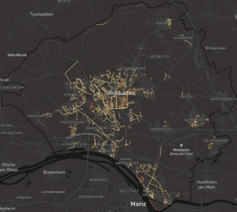

# EqualStreetNames Wiesbaden

This repository contains the [EqualStreetNames](https://equalstreetnames.org/) submodule
for [Wiesbaden, Germany](https://www.wiesbaden.de).

The map at [wiesbaden.equalstreetnames.eu](https://wiesbaden.equalstreetnames.eu) shows the streets and places in Wiesbaden, Germany, tagged with `name:etymology:wikidata`
in [OpenStreetMap](https://www.openstreetmap.org) (and some additional data added locally), and visualizes the
**gender-distribution** of their names.



You can contribute to OpenStreetMap by adding the tag `name:etymology:wikidata=<wikidata id>` (see below).

This repository was generated from
the [EqualStreetNames City Template](https://github.com/EqualStreetNames/equalstreetnames-template). If you want to
replicate the EqualStreetNames project in your city, take a look at the how-to in that repository.

## Overpass Query and Editing Workflow

To download the data for all streets in Wiesbaden from OpenStreetMap (e.g. in [JOSM](https://josm.openstreetmap.de/) expert mode),
this query can be used against an [Overpass API](https://wiki.openstreetmap.org/wiki/Overpass_API):

```
[out:xml][timeout:2500];
{{geocodeArea:Wiesbaden}}->.searchArea;
(
  way["highway"]["name"](area.searchArea);>;
  relation["highway"]["name"](area.searchArea);>;
);
out meta;
```

You can then search this dataset in JOSM (`CTRL + F`) for a specific street, e.g. `type:way and Rheinstraße`, and add
the `name:etymology:wikidata` key and value to the selected way/relation.

Similarly, a list in CSV format can be retrieved using [this Overpass Turbo query](https://overpass-turbo.eu/s/1equ).
The result contains the `type` (`way` or `relation`), `id`, `name` and `name:etymology:wikidata` values of each street.
This can be useful to (collaboratively) keep track of research/mapping progress.

## Sources

In addition to on-site signs, these are some of the best sources for the origin of street names:

* Personal- und Organisationsamt Wiesbaden, "Nach Persönlichkeiten benannte Straßen", 2018 [[Download PDF](https://piwi.wiesbaden.de/dokument/1/556779)].
* Reiß, Thorsten (1996), Wiesbadens Straßennamen. Innenstadt und Klarenthal. Herkunft und Bedeutung. Thorsten Reiß
  Verlag, Wiesbaden.
* Glöckler, Peter-Michael (2021), Wiesbadener Straßennamen. Biebrich. Thorsten Reiß Verlag, Wiesbaden.

The latter two books are available at the Wiesbaden public library ([Mauritius Mediathek](https://bond.wiesbaden.de/)).
